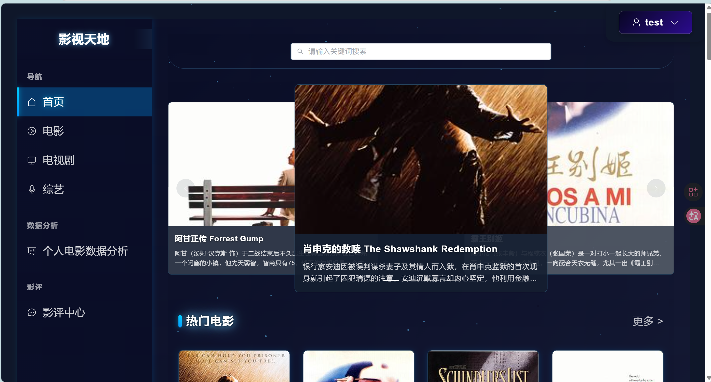
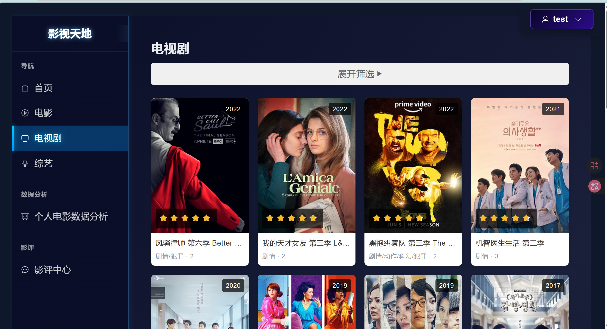
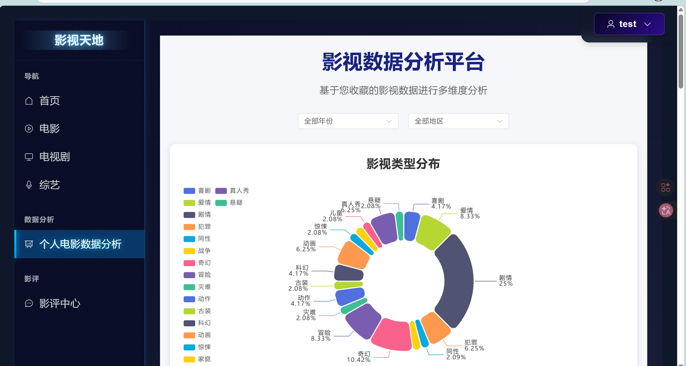
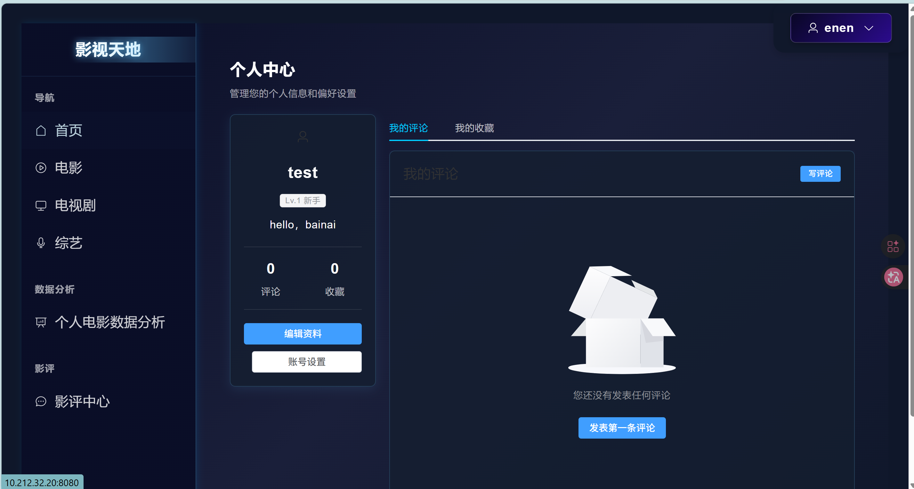

# 影视推荐平台
基于Django框架和Vue.js框架前后端分离架构的系统

## 本地启动方法

### 先修改实际配置（位置如下）：

修改实际IP位置：
	backend/backend/settings.py 63  190 ； fore/api/axios.js  6

修改数据库位置：
	backend/backend/settings.py 121

修改邮箱配置位置：
	backend/backend/settings.py 183-185

填写密钥：
	backend/backend/settings.py 23


### 启动后端（Django）：

1. 进入后端目录：
   
   ```bash
   
   cd backend

2. 安装依赖：
   
   ```bash

   pip install -r requirements.txt

3. 启动服务器：
   
   ```bash
   
   python manage.py runserver ； python manage.py 0.0.0.0:8000

### 启动前端（Vue.js）：

1. 进入前端目录：
   
   ```bash
   
   cd fore

2. 安装依赖：
   
   ```bash

    npm install

3. 启动服务器：
   
   ```bash
   
   npm run serve

# 系统展示
<p align="center">
  
</p>
<p align="center">
  
</p>
<p align="center">
  
</p>
<p align="center">
  
</p>
